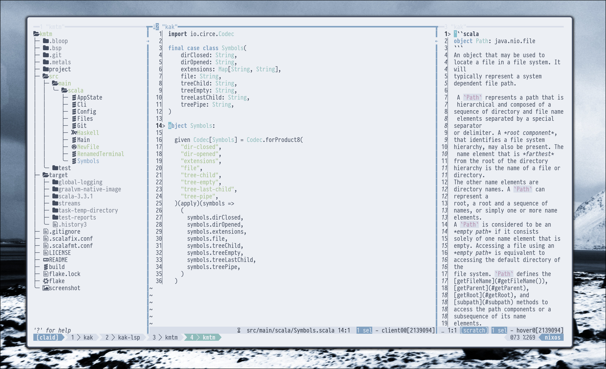

# KMTM
A simple file manager intended to be used in combination with TUI editors like Neovim, Helix, Kakoune.



## Motivation
Existing solutions like [`broot`](https://github.com/Canop/broot), [`yazi`](https://github.com/sxyazi/yazi) or [`nnn`](https://github.com/jarun/nnn) are too advanced, complex and powerful. \
The [`kakoune-filetree`](https://github.com/occivink/kakoune-filetree) and [`kaktree`](https://github.com/andreyorst/kaktree) are good projects, but Kakoune specific.

## Usage
```
Usage: kmtm --root <file> [--focused <file>] --on-focus-change <string> --on-enter <string>

Simple filetree

Options and flags:
    --help
        Display this help text.
    --root <file>, -r <file>
        Root project directory.
    --focused <file>, -f <file>
        File or directory currently focused with the root directory.
    --on-focus-change <string>
        A command to run when the focus is moved to another file, '{}' is a placeholder for the absolute file path.
    --on-enter <string>
        A command to run when the file is opened.
```

## Features
* Highlight Git modified and new files.
* Create, rename and delete files.
* Show/hide Git ignored file.

## Configuration
Located at `${XDG_CONFIG_HOME}/kmtm/config.json`, fallsback to `${HOME}/.config/kmtm/config.json`. \
If no configuration found then generates the default configuration.

## Building

### Nix
If you have `nix` installed with `flakes` enabled, then simply:
```
$ nix run github:igor-ramazanov/kmtm -- --help
```

### GraalVM Native Image
The app uses SBT and GraalVM Native Image. \
Make sure the `sbt` and `native-image` commands are available, then `sbt GraalVMNativeImage/packageBin`. \
The binary will be in the `/target/graalvm-native-image/kmtm`.


## TODOs
* Help page within the app.
* Build instructions.
* Build as a static binary.

## Example usage
With `tmux` + `kakoune`:

`~/.config/kak/kakrc`:
```KakouneScript
# File tree view
define-command toggle-file-tree %{nop %sh{
  CURRENT_WORKING_PATH="$(tmux display -pF '#{pane_current_path}')"

  PROJECT_VIEW="kmtm \
    --root \"$CURRENT_WORKING_PATH\" \
    --focused \"$kak_buffile\" \
    --on-focus-change \"echo 'evaluate-commands -client $kak_client edit {}' | kak -p $kak_session\" \
    --on-enter \"tmux select-pane -t '{right-of}'\""

  tmux split-pane -hbl 25% \
    -c "$CURRENT_WORKING_PATH" \
    -e CURRENT_WORKING_PATH="$CURRENT_WORKING_PATH" -- "$PROJECT_VIEW"

}}
map global user t ":toggle-file-tree<ret>" -docstring "Open project view"
```

On pressing `t` Kakoune will spin up a left tmux pane in the same working directory and opening the `kmtm` files manager. \
The `kmtm` will be asked to send the `evaluate-commands edit {}` back the Kakoune on each file focus change, and moving the tmux focus back to the editor as an opening action on files.

